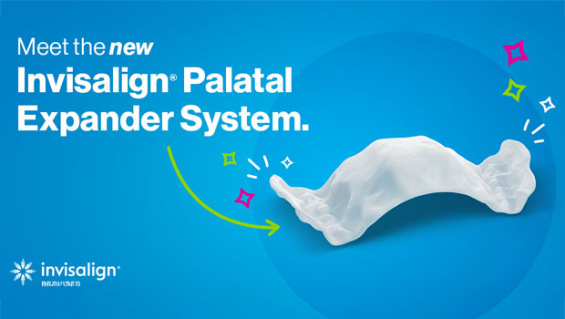

If your child is between **6 and 11 years old** and has crowded teeth, a narrow smile, or bite concerns, [early orthodontic treatment](/treatments/invisalign/) can make a lasting difference. One of the most effective early solutions is an **Invisalign palatal expander for kids** - a modern, comfortable way to guide jaw growth at the right time.

At **Hawaiian Smiles Orthodontics**, [Dr. Satya Nayak](/about/doctors/) and [Dr. Nicole Nayak](/about/doctors/) specialize in early orthodontic care designed for growing children. Invisalign palatal expanders allow kids to widen the upper jaw **without bulky metal appliances**, helping create space for adult teeth and reducing the risk of more complex treatment later.

### **What Is an Invisalign Palatal Expander?**

An **Invisalign palatal expander** is a removable orthodontic appliance designed to **gently widen the upper jaw while it is still developing**. This treatment is most effective during the early growth years - typically ages **6 to 11** - when the bones of the upper jaw have not yet fused.

Unlike traditional metal expanders that are cemented in place, Invisalign palatal expanders are:

- Custom-made using 3D digital scans
- Removable for eating and cleaning
- More comfortable and less intimidating for kids
- Easier for parents to help keep clean

Expansion happens gradually through a **series of custom expanders**, each one slightly wider than the last. This controlled process creates space for permanent teeth, supports proper bite alignment, and encourages healthy jaw development.

### **Why Invisalign Palatal Expanders Are Ideal for Kids Ages 6–11**

Parents often assume orthodontic treatment should wait until all adult teeth have erupted. However, early treatment with an **Invisalign palatal expander for kids** can take advantage of natural growth - often preventing more serious issues later.

During the mixed dentition phase (when kids have both baby and adult teeth):

- The upper jaw responds more easily to expansion
- Treatment is typically faster and more stable
- Jaw growth can be guided instead of corrected
- Future crowding and bite problems may be reduced or avoided

Early expansion can simplify or shorten later orthodontic treatment during the teen years.

### **Is Your Child a Good Candidates for an Invisalign Palatal Expander?**

Children between **6 and 11 years old** may benefit from an Invisalign palatal expander if they show early signs of jaw or bite imbalance.

Your child may be a good candidate if they have:

- Crowded or overlapping teeth
- A narrow upper jaw or tight smile
- A crossbite (upper teeth biting inside the lower teeth)
- Adult teeth erupting crooked or blocked
- Mouth breathing or airway concerns
- Early orthodontic issues identified by a dentist

At Hawaiian Smiles Orthodontics, Dr. Nayak evaluates facial growth, jaw width, and tooth eruption patterns to determine whether an Invisalign palatal expander for kids is the right solution.

### **What Conditions Can an Invisalign Palatal Expander Treat?**

Early palatal expansion plays a critical role in preventing and correcting common childhood orthodontic problems.

**Crowding in Developing Smiles**

A narrow upper jaw often leads to crowded teeth. Expanding the palate early creates space before crowding becomes severe, reducing the chance of tooth extractions later.

**Crossbites**

Crossbites are common in children with narrow jaws. If left untreated, they can affect facial growth and jaw symmetry. Invisalign palatal expanders help correct crossbites early and comfortably.

**Narrow Dental Arches**

A narrow dental arch can impact both function and appearance. Expansion supports a broader, more balanced smile and healthier bite alignment.

**Preparation for Invisalign or Braces**

An Invisalign palatal expander for kids is often part of Phase 1 orthodontic treatment, creating the foundation for smoother, more efficient treatment with Invisalign or braces later.

**Airway Support**

In some children, widening the upper jaw may help improve nasal airflow and reduce mouth breathing - an important benefit during growth and development.

### **What Parents Can Expect During Treatment**

One of the biggest advantages of an Invisalign palatal expander for kids is how child-friendly and parent-approved the process is.

**Step 1: Orthodontic Evaluation**

Your child receives a comprehensive exam, including digital scans and growth assessment.

**Step 2: Custom Expander Design**

Each expander is custom-made for comfort and effectiveness—no metal bands or screws.

**Step 3: Gradual Expansion**

Your child wears a series of expanders that slowly widen the palate. Most kids feel mild pressure at first, which fades quickly.

**Step 4: Growth Monitoring**

Once expansion is complete, the jaw stabilizes before moving into the next phase of orthodontic care.

Parents appreciate that Invisalign expanders are removable, making brushing, flossing, and eating easier than with traditional appliances.

### **Invisalign Palatal Expander for Kids: FAQs**

1. **What age is best for an Invisalign palatal expander?** Ages 6–11 is ideal because the upper jaw is still growing and easier to guide.
2. **Is a palatal expander painful?** Most children experience only mild pressure for a short time.
3. **How long does expansion take?** Active expansion usually takes a few months, followed by a stabilization period.
4. **Will my child have trouble talking with a palatal expander?** Some kids notice a brief adjustment period, but speech typically normalizes quickly.
5. **Can my child remove their expander?** Yes. Invisalign palatal expanders for kids are removable, which improves comfort and hygiene.
6. **Will my child still need braces or Invisalign later?** Often yes - but early expansion can make future treatment easier and shorter.
7. **Is early treatment really necessary?** Early treatment can prevent more serious orthodontic problems and reduce the need for complex correction later.
8. **How often are orthodontic visits needed?** Visits are scheduled periodically to monitor progress and ensure healthy jaw and bite development.

### **Schedule a Consultation for Your Child Today**

Choosing the right time for orthodontic treatment can make a lifelong difference. An **Invisalign palatal expander for kids** allows orthodontists to guide jaw growth early—often preventing more complicated issues later.

At **Hawaiian Smiles Orthodontics**, Dr. Satya Nayak and Dr. Nicole Nayak provide personalized, growth-focused care for children and families across Hawaii.

**Visit us in:**

- [Kaneohe](https://g.page/hawaiiansmilesortho-kaneohe?gm)
- [Kailua-Kona](https://g.page/hawaiiansmilesortho-kailua-kona?gm)
- [Kamuela](https://g.page/hawaiiansmilesortho-kamuela?gm)

If your child is between **6 and 11 years old** and showing signs of crowding or bite issues, [schedule a **new patient consultation**](/appointment/) today to find out if an Invisalign palatal expander is the right first step toward a healthy, confident smile.
